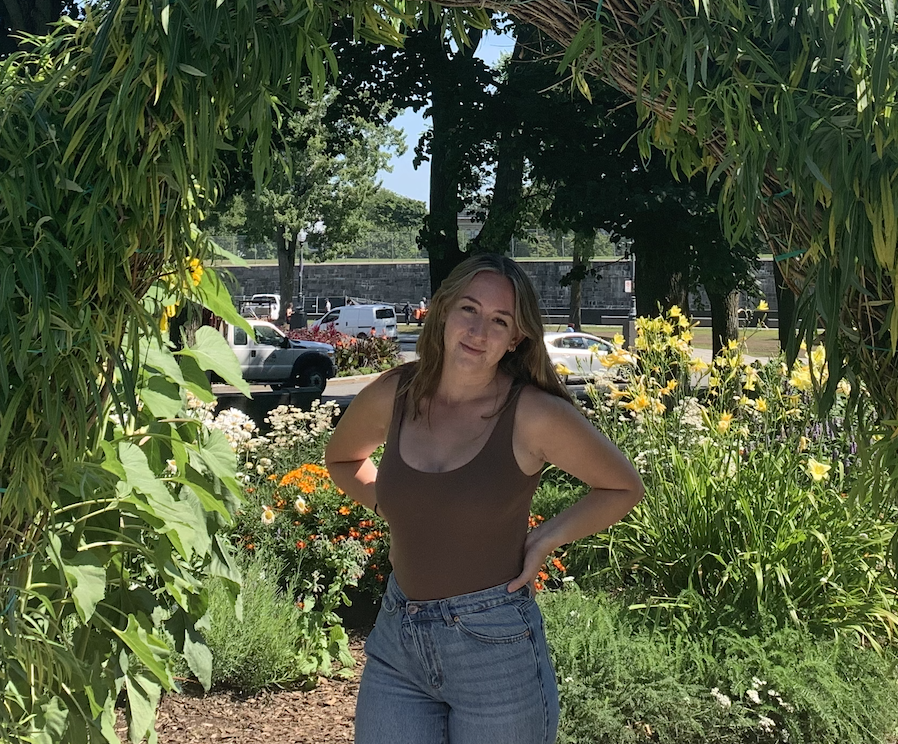

# ✨ Isabella Galante ✨
> ## :wave: Welcome! Happy you're here. 
--- 
### **<mark>About Me:</mark>**

- 4th year Pychology Major 📚
- **Why Psych?** I originally wanted to persue a degree in criminology or another field related to law & justice, but found myself drawn to psych after watching too many true crime shows during covid and spending a long time wondering ***what leads someone to commit a crime?*** Because of that I decided to major in psychology and take a lot of classes related to forensics and psychopathology. 
- **Why PSYO 3505?** I wanted to branch out and learn something outside my comfort zone. I took CSCI 1105 💻 in my first year and it was such a nice challenge, so I decided to look for another course that involves coding somehow and looks like it could challenge me. 
- **Future Plans?** After my undergrad I want to travel for a year or two 🌎 going to all the normal tourist destinations like Western Europe and Australia, but also other smaller less touristy countries throughout the Eurasian continent. After that I'll *probably* go to grad school for a master's degree in psychology. 
